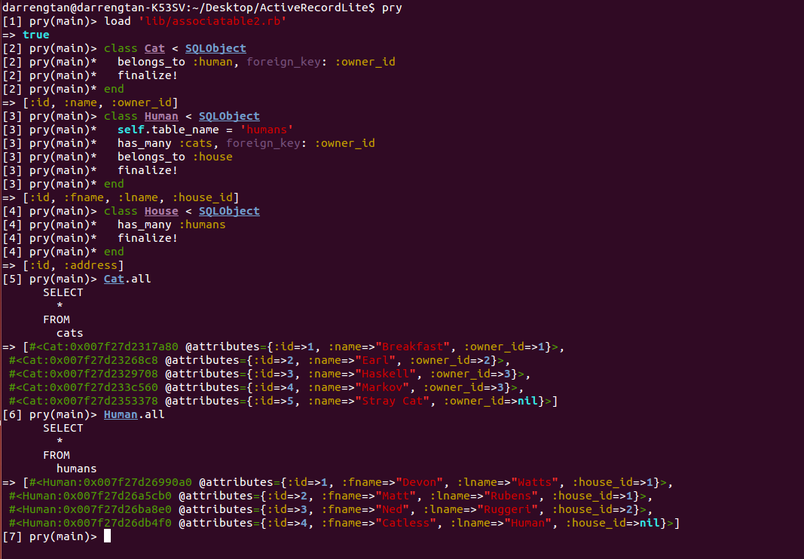
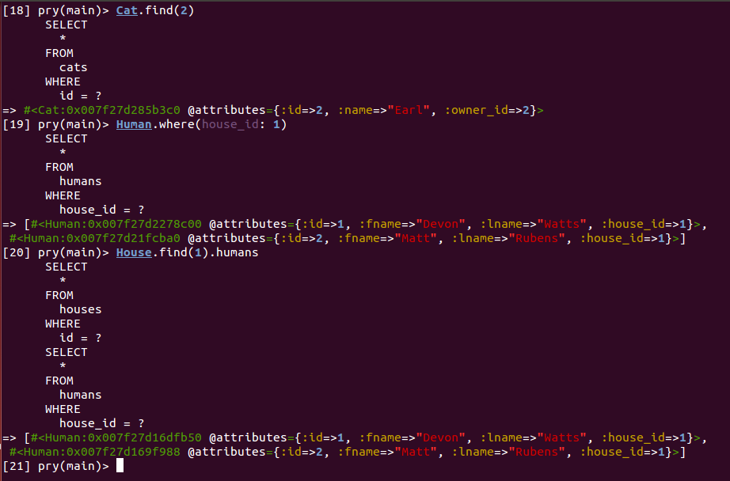

# ActiveRecord Lite

This is an ODM that implements some features that ActiveRecord would normally
provide.

## Features

* **SQLObject**: SQLObject is a class that will interact with the database. The
base class has the following features.

  * `::all` returns an array of all records in the DB
  * `::find` looks up a single record by primary key/id
  * `#insert` inserts a new row into the table to represent the SQLObject
  * `#update` updates the row with the id of the given SQLObject
  * `#save` method that calls either insert or update depending on whether or
  not the SQLObject already exists in the table (based on presence of id)

Figure 1: How to set up ActiveRecord Lite

* **Searchable**: Searchable is a module added to the SQLObject class to allow
searching based on a specific attribute value.
  * `#where` returns an array of the records that match the given condition.

* **Associatable**: Associatable is another module mixed in to SQLObject that
provides several associations between tables. This is done through an
AssocOptions class that will store the necessary information and provide
default values for `#primary_key`, `#foreign_key`, and  `#class_name`. The
associations include the following.
  * `belongs_to`
  * `has_many`
  * `has_one_through`

Figure 2: Associations example
